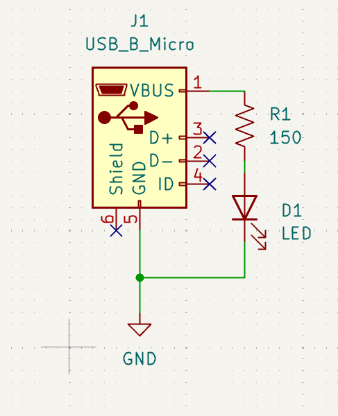
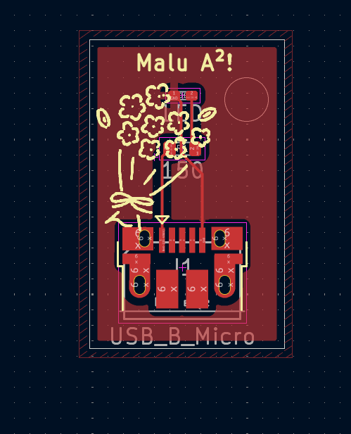
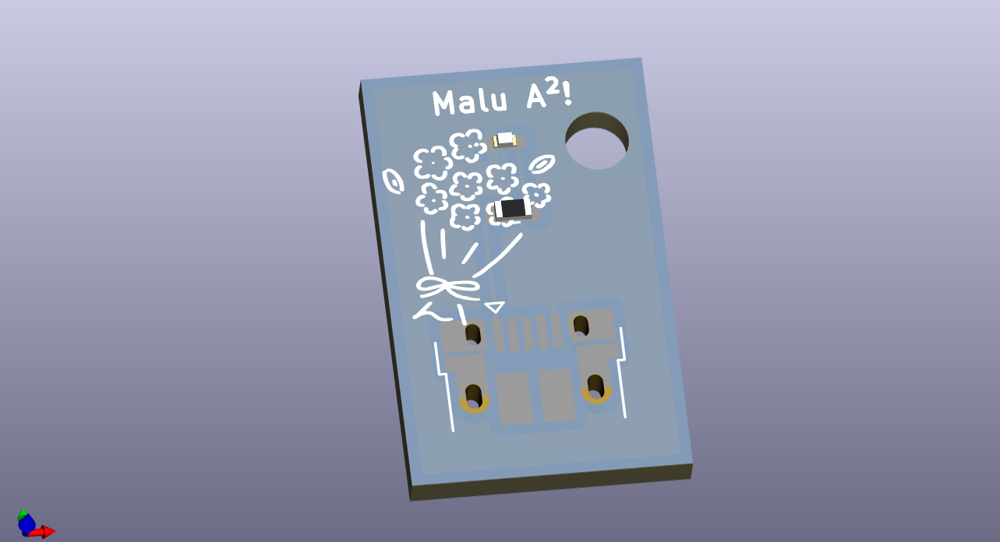

# Keychain Cute


This project is exactly what it sounds like: a keychain that is also a PCB. I really wanted to make something small, fun, and tangible, and what better way to do that than turning a PCB into a keychain? It’s simple, it lights up, and it’s a tiny excuse to say “yeah, I designed this board myself” 😌 This is a USB-powered LED keychain made entirely from a PCB. When you plug it into a USB port, the LED turns on.

## Screenshots




## Project Structure
```
/
├── images/
│   ├── key_3d.png      
│   ├── key_pcb.png    
│   └── key_schematic.png  
│
├── pcb/
│   ├── gerbers/            # Manufacturing files
│   ├── keychainmalu.kicad_pcb
│   ├── keychainmalu.kicad_pro
│   └── keychainmalu.kicad_sch
│
├── LICENSE
└── README.md
```
