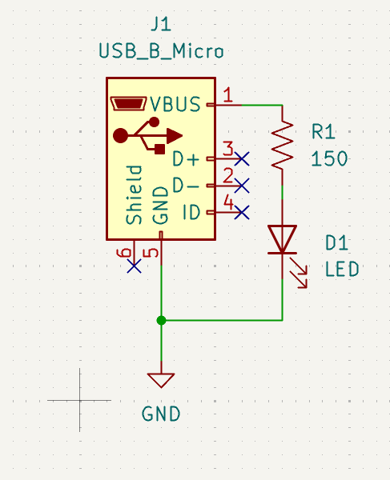
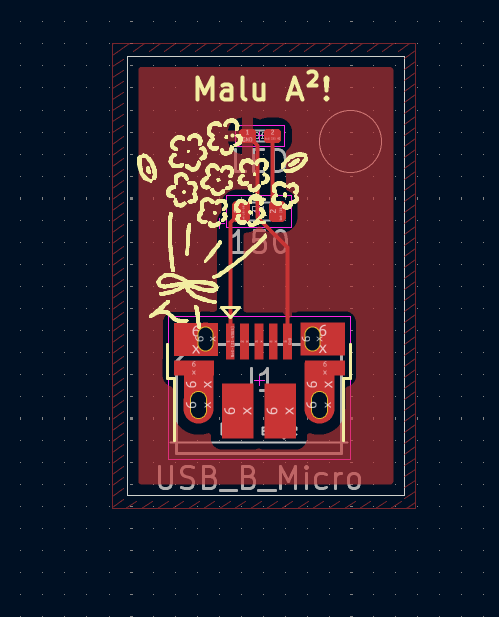
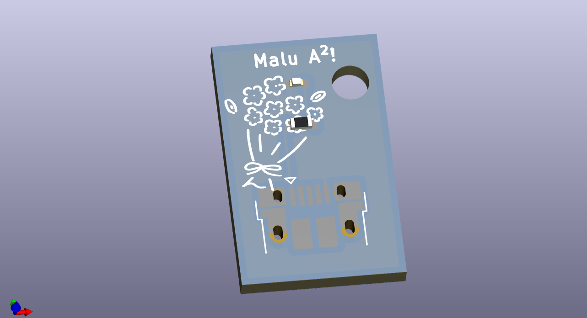

# Keychain Cute


This project is exactly what it sounds like: a keychain that is also a PCB. I really wanted to make something small, fun, and tangible, and what better way to do that than turning a PCB into a keychain? It’s simple, it lights up, and it’s a tiny excuse to say “yeah, I designed this board myself” 😌 This is a USB-powered LED keychain made entirely from a PCB. When you plug it into a USB port, the LED turns on.

## Screenshots




## Project Structure
```
/
├── images/
│   ├── key_3d.png      
│   ├── key_pcb.png    
│   └── key_schematic.png  
│
├── pcb/
│   ├── gerbers/            # Manufacturing files
│   ├── keychainmalu.kicad_pcb
│   ├── keychainmalu.kicad_pro
│   └── keychainmalu.kicad_sch
│
├── LICENSE
└── README.md
```
## BOM
| Item        | URL | Quantity | Unit Price ($) | Total Price ($) | Running Total (With tax) $ |
|------------|-----|----------|----------------|-----------------|-----------------------------|
| USB B Micro | https://www.aliexpress.com/p/tesla-landing/index.html?scenario=c_ppc_item_bridge&productId=1005004280682450&_immersiveMode=true&withMainCard=true&src=google&aff_platform=true&isdl=y&src=google&albch=shopping&acnt=768-202-3196&isdl=y&slnk=&plac=&mtctp=&albbt=Google_7_shopping&aff_platform=google&aff_short_key=UneMJZVf&gclsrc=aw.ds&&albagn=888888&&ds_e_adid=&ds_e_matchtype=&ds_e_device=c&ds_e_network=x&ds_e_product_group_id=&ds_e_product_id=pt1005004280682450&ds_e_product_merchant_id=419595364&ds_e_product_country=BR&ds_e_product_language=pt&ds_e_product_channel=online&ds_e_product_store_id=&ds_url_v=2&albcp=21106536414&albag=&isSmbAutoCall=false&needSmbHouyi=false&gad_source=1&gad_campaignid=21106537179&gbraid=0AAAAAC_WlP-md_4YkkXvbSPrNxDPgsh7s&gclid=Cj0KCQiA18DMBhDeARIsABtYwT3UV9D02O19ZPgyw6MjiTx4fNWhK0_kbgUcWJ6lp5j0MogO0UyYT0MaAqDiEALw_wcB | 1 | 1,06 | 1,06 | 7,08 |
| LED | https://shopee.com.br/product/413370384/18345362456 | 1 | 1,34 | 1,34 | 1,34 |
| PCB | https://cart.jlcpcb.com/ | 1 | 2,2 | 2,2 | 12,58 |
